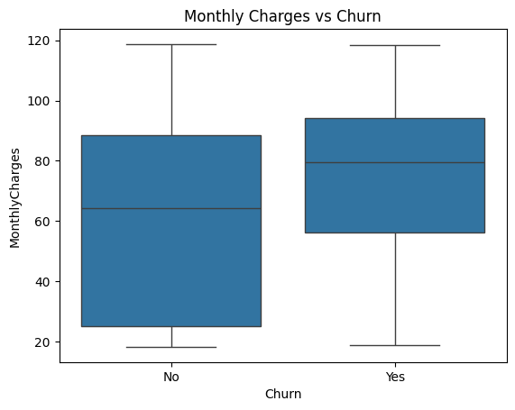
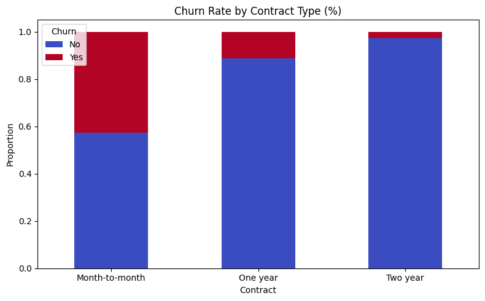
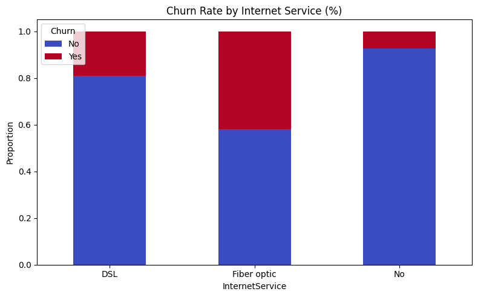
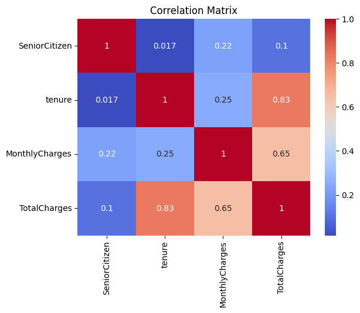
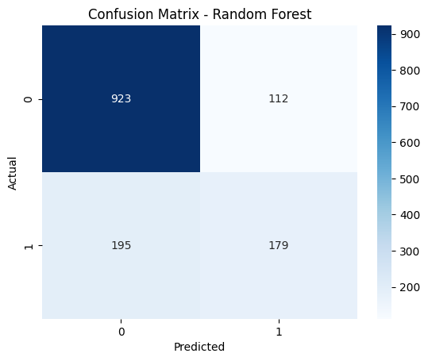
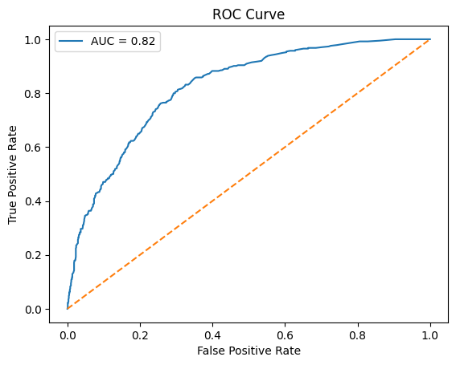
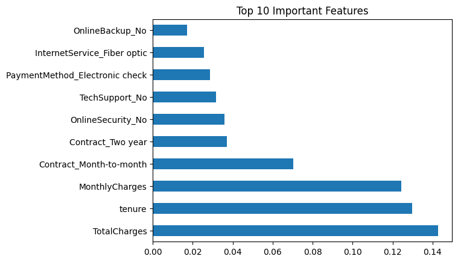

# 📉 Telco Customer Churn Prediction


A machine learning project to predict customer churn using the Telco Customer Churn dataset from Kaggle.

---

## 📌 Project Overview

Customer churn is one of the most critical metrics for telecom companies. This project builds and evaluates machine learning models to predict whether a customer will churn based on their demographic and service usage data.

| Detail | Info |
|--------|------|
| Dataset | [Telco Customer Churn – Kaggle](https://www.kaggle.com/code/basmalaawad/telco-customer-churn-dataset/input) |
| Rows | 7,043 |
| Columns | 21 |
| Target Variable | `Churn` (Yes / No) |
| Class Imbalance | ~73% No Churn / ~27% Churn |

---

## 🗂️ Project Structure

```
telco-churn-prediction/
│
├── Customer Churn Prediction.ipynb   # Main notebook
├── images/                           # Saved visualization outputs
│   ├── churn_distribution.png
│   ├── correlation_matrix.png
│   ├── monthly_charges_vs_churn.png
│   ├── contract_vs_churn.png
│   ├── internet_service_vs_churn.png
│   ├── confusion_matrix.png
│   ├── roc_curve.png
│   └── feature_importance.png
└── README.md
```

---

## 🔄 Workflow

1. **Data Loading** – Load dataset via `kagglehub`
2. **Data Understanding** – Shape, types, class distribution
3. **Data Cleaning** – Handle missing values, drop irrelevant columns
4. **Exploratory Data Analysis (EDA)** – Visualize churn patterns
5. **Feature Engineering** – Encode categorical, scale numerical features
6. **Model Training** – Logistic Regression & Random Forest
7. **Model Evaluation** – Accuracy, F1-score, ROC-AUC
8. **Conclusion** – Insights & business recommendations

---

## 📊 Exploratory Data Analysis

### Churn Distribution
> ~27% of customers churned — indicating a class imbalance that was handled using `class_weight='balanced'`.


---

### Monthly Charges vs Churn
> Churned customers (Yes) have a higher median monthly charge (~$80) compared to non-churned customers (~$65).  
> The interquartile range for churners is also narrower and shifted upward, confirming that higher monthly bills are a strong churn signal.



---

### Contract Type vs Churn (Proportion)
> Visualized as a **stacked bar chart by proportion** to account for class imbalance.  
> - **Month-to-month**: ~43% churn rate — by far the highest risk group  
> - **One year**: ~11% churn rate  
> - **Two year**: ~3% churn rate — most loyal customers



```python
contract_churn = df.groupby('Contract')['Churn'].value_counts(normalize=True).unstack()
contract_churn.plot(kind='bar', stacked=True, colormap='coolwarm', figsize=(8,5))
plt.title("Churn Rate by Contract Type (%)")
plt.ylabel("Proportion")
plt.xticks(rotation=0)
plt.legend(title='Churn', labels=['No', 'Yes'])
plt.tight_layout()
plt.show()
```

---

### Internet Service vs Churn (Proportion)
> Visualized as a **stacked bar chart by proportion** to account for class imbalance.  
> - **Fiber optic**: ~42% churn rate — highest among all service types  
> - **DSL**: ~19% churn rate  
> - **No internet service**: ~7% churn rate — lowest risk group



```python
internet_churn = df.groupby('InternetService')['Churn'].value_counts(normalize=True).unstack()
internet_churn.plot(kind='bar', stacked=True, colormap='coolwarm', figsize=(8,5))
plt.title("Churn Rate by Internet Service (%)")
plt.ylabel("Proportion")
plt.xticks(rotation=0)
plt.legend(title='Churn', labels=['No', 'Yes'])
plt.tight_layout()
plt.show()
```

---

### Correlation Matrix
> TotalCharges, MonthlyCharges, and tenure are the most correlated numerical features with churn.



---

## 🧪 Models & Results

| Model | CV AUC | Accuracy | Precision (Churn) | Recall (Churn) | F1 (Churn) | Weighted F1 |
|-------|--------|----------|-------------------|----------------|------------|-------------|
| Logistic Regression | **0.8453** | 0.74 | 0.50 | **0.78** | **0.61** | 0.75 |
| Random Forest | 0.8238 | **0.78** | **0.62** | 0.48 | 0.54 | **0.77** |

> 🔍 **Model Comparison:**
> - **Logistic Regression** has higher CV AUC (0.8453) and churn recall (0.78) — better at ranking and catching actual churners.
> - **Random Forest** has higher accuracy (0.78) and precision (0.62) — more conservative, fewer false alarms.
>
> ✅ **Model choice depends on business priority:**
> - Use **Logistic Regression** if the goal is to capture as many at-risk customers as possible *(minimize missed churners)*.
> - Use **Random Forest** if the goal is to target only high-confidence churners *(minimize wasted retention spend)*.

---

## 🔍 Confusion Matrix (Random Forest)

> Out of 1,409 test samples:
> - **True Negative (TN):** 923 — correctly predicted as not churn
> - **False Positive (FP):** 112 — predicted churn but actually stayed
> - **False Negative (FN):** 195 — missed actual churners ⚠️
> - **True Positive (TP):** 179 — correctly predicted as churn



---

## 📈 ROC Curve (Random Forest)

> AUC = **0.82** — the model has good discriminative ability to distinguish churners from non-churners.  
> The curve rises steeply early, indicating strong performance at low false positive rates.



---

## 🏆 Top 10 Feature Importances

> The most influential features in predicting churn based on Random Forest importance scores.



| Rank | Feature | Importance | Description |
|------|---------|------------|-------------|
| 1 | `TotalCharges` | ~0.145 | Total amount charged to customer |
| 2 | `tenure` | ~0.130 | Number of months with the company |
| 3 | `MonthlyCharges` | ~0.125 | Current monthly bill |
| 4 | `Contract_Month-to-month` | ~0.070 | Short-term contract type |
| 5 | `Contract_Two year` | ~0.037 | Long-term contract type |
| 6 | `OnlineSecurity_No` | ~0.035 | No online security subscription |
| 7 | `TechSupport_No` | ~0.033 | No tech support subscription |
| 8 | `PaymentMethod_Electronic check` | ~0.030 | Payment via electronic check |
| 9 | `InternetService_Fiber optic` | ~0.027 | Fiber optic internet users |
| 10 | `OnlineBackup_No` | ~0.022 | No online backup subscription |

> 💡 The top 3 features (`TotalCharges`, `tenure`, `MonthlyCharges`) are all **numeric and billing-related**, contributing more than 2x the importance of any categorical feature.

---

## 💡 Business Recommendations

| Problem | Recommendation |
|---------|---------------|
| High churn on month-to-month contracts | 📋 Offer incentives to switch to annual contracts |
| High monthly charges cause churn | 💰 Provide loyalty discounts or bundled packages |
| New customers churn early | 🎁 Create onboarding programs for first 3–6 months |
| Fiber optic users churn more | 🛡️ Improve service quality and offer tech support |

---

## 🛠️ Tech Stack

| Library | Purpose |
|---------|---------|
| `pandas`, `numpy` | Data manipulation |
| `matplotlib`, `seaborn` | Visualization |
| `scikit-learn` | Preprocessing, modeling, evaluation |
| `kagglehub` | Dataset download |

---

## 🚀 How to Run

1. **Clone the repository**
   ```bash
   git clone https://github.com/your-username/telco-churn-prediction.git
   cd telco-churn-prediction
   ```

2. **Install dependencies**
   ```bash
   pip install pandas numpy matplotlib seaborn scikit-learn kagglehub
   ```

3. **Open the notebook**
   ```bash
   jupyter notebook "Customer Churn Prediction.ipynb"
   ```

   Or open directly on [](https://colab.research.google.com/drive/1y9cnKU95Fru64KW-XKL4NKsW-giCp14V)

---

## 📄 License

This project is open-source and available under the [MIT License](LICENSE).

---

## 🙋 Author

Made by [adin-alxndr](https://github.com/adin-alxndr/)
